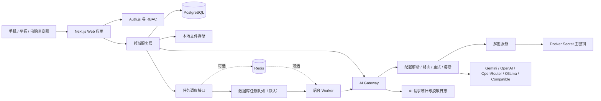
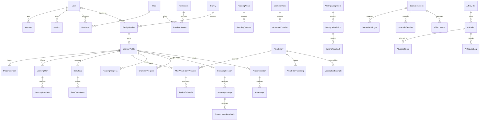

# AI 家庭英语学习平台：架构与实施计划

> 状态：架构已确认，阶段 1–2 已完成
> 目标环境：群晖或普通 Linux NAS，Docker Compose，家庭内网优先
> 核心原则：低维护、易备份、资源可控、家庭数据隔离、AI 服务可热切换

## 1. 需求分析与范围

### 1.1 产品边界

系统服务于单个 NAS 上的一个或少量家庭，不按公有 SaaS 的超大并发设计。它仍然采用严格的家庭级数据隔离和后端权限校验，避免家庭成员之间或未来多家庭部署时发生越权。

平台包含三类能力：

1. 身份、家庭、权限、学习档案和报告等业务基础。
2. AI 教师、内容生成、批改、计划生成等模型驱动能力。
3. 单词、阅读、语法、口语、写作、场景课和每日任务等学习能力。

按照需求中的七个阶段增量交付。本轮仅确认架构，不生成阶段 1 代码。

### 1.2 非功能目标

- 默认部署只需 `app + postgres + adminer`；Redis 和 Worker 使用 Compose profile 按需启用。
- 浏览器不直接持有或调用第三方 AI API Key。
- AI 配置保存在数据库，修改后通过短 TTL 缓存失效即时生效，不依赖容器重启。
- PostgreSQL、上传、日志、备份和 secrets 分开挂载。
- 所有持久业务写入 PostgreSQL；大文件使用本地文件系统，数据库只保存元数据和相对路径。
- 优先支持 1–10 个家庭成员、低并发和 NAS 资源受限环境；长任务异步化，但不强制引入 Redis。
- 中英文界面使用路由级国际化；学习内容自身分别保存英文、中文辅助及结构化元数据。

### 1.3 建议的首版取舍

- Next.js 采用单体模块化架构，而不是微服务。
- Next.js App Router + Server Components；交互区域使用 Client Components。
- Auth.js 使用数据库 Session，凭据登录作为首版入口；密码使用 Argon2id。
- UI 使用 Tailwind CSS 和 shadcn/ui，支持深色、大字体和移动端。
- 后台任务首版以数据库任务表驱动；生成量增大后启用 Redis/BullMQ Worker。
- PWA、完整备份恢复、外部语音服务和视频生成留在既定后续阶段。
- Adminer 只绑定 NAS 内网端口，建议用 Compose profile 启动，不暴露公网。

## 2. 系统架构

### 2.1 逻辑架构



### 2.2 部署拓扑

| 容器 | 默认启用 | 职责 | 建议资源 |
|---|---:|---|---|
| `app` | 是 | Next.js 页面、API、认证、短任务 | 1–2 CPU，1–2 GB RAM |
| `postgres` | 是 | 业务数据、配置、任务状态 | 1 CPU，1–2 GB RAM |
| `adminer` | 是/按需 | 内网数据库管理 | 128–256 MB RAM |
| `redis` | 否 | BullMQ、缓存、速率限制加速 | 128–256 MB RAM |
| `worker` | 否 | AI 生成、报告、TTS 等长任务 | 1–2 CPU，512 MB–2 GB RAM |
| `backup` | 后续 | 定时 `pg_dump` 与文件清单 | 按任务临时使用 |

建议持久化目录：

```text
./data/postgres/       PostgreSQL 数据
./uploads/             用户录音、图片、生成音频等
./logs/                应用和任务日志（轮转）
./backups/database/    pg_dump 备份
./backups/uploads/     上传文件归档或清单
./backups/config/      不含密钥明文的配置导出
./secrets/             Docker secrets，仅宿主机管理员可读
```

生产部署中容器内使用 `/app/uploads`、`/app/logs`、`/backups` 和 `/run/secrets/*`。数据库密码、Auth Secret、设置加密主密钥与初始化管理员信息可来自 Docker secrets；不得把 AI Provider 配置放入 Compose 环境变量。

### 2.3 模块边界

```text
Identity        User / Account / Session / 登录安全
Family          Family / FamilyMember / 家庭数据隔离
Authorization   Role / Permission / UserRole / policy
Learner         LearnerProfile / 水平测试 / 能力画像
Planning        LearningPlan / DailyTask / 报告
Vocabulary      词库 / 个人掌握度 / 间隔重复
Reading         分级文章 / 题目 / 阅读进度
Grammar         语法知识点 / 练习 / 薄弱项
Speaking        录音 / 识别 / 发音反馈
Writing         作业 / 版本 / 批改反馈
Scenario        美国生活英语 / 对话 / 视频课
Tutor           AI 对话 / 消息 / 复习收藏
AI Platform     Provider / Model / Route / Gateway / 日志
Operations      设置 / 上传 / 通知 / 审计 / 健康 / 备份
```

模块之间通过服务接口调用。路由和 React 组件不得直接实例化 Prisma 或第三方 AI SDK；Server Action/API Route 调用应用服务，应用服务调用仓储与基础设施适配器。

### 2.4 请求与权限链路

每个受保护请求依次执行：

1. Auth.js 验证 Session。
2. 加载用户全局角色和当前家庭成员关系。
3. RBAC 判断操作权限。
4. 数据访问策略校验目标记录的 `familyId` / `learnerProfileId`。
5. 服务层执行业务规则和数据库事务。
6. 对敏感管理操作写入 AuditLog。

`SystemAdmin` 是系统级角色；`FamilyOwner`、`Parent`、`Learner`、`Child` 的权限必须结合 FamilyMember 归属判断。仅具有权限并不足以访问其他家庭的数据。

### 2.5 AI Gateway 设计

统一接口分为 Provider Adapter 与 Gateway 两层：

```ts
interface AIProvider {
  chat(input: ChatInput): Promise<ChatResponse>;
  generateStructured<T>(input: StructuredInput<T>): Promise<T>;
  testConnection(): Promise<ProviderTestResult>;
  healthCheck(): Promise<ProviderHealth>;
}
```

- Adapter：处理各厂商鉴权、请求格式、响应格式和错误映射。
- Gateway：按用途查询 AIUsageRoute，选择主模型与备用模型，执行超时、有限重试、429/超时切换、结构校验、统计和日志。
- 配置缓存：进程内 30–60 秒 TTL；后台修改配置后发布版本号/主动失效。单容器首版无需 Redis；多 app 实例时使用 Redis pub/sub 或数据库版本轮询。
- API Key：AES-256-GCM；每条密文保存 `ciphertext + iv + authTag + keyVersion`。主密钥只从 secret 文件读取。
- 结构化输出：模型响应先解析 JSON，再通过对应 Zod Schema；失败后使用修复提示重试一次，仍失败则记录错误且不写业务表。
- 日志：只保存用途、模型、状态、Token、延迟、错误分类和脱敏摘要/哈希；不保存 API Key 或完整敏感 prompt。
- 自动切换：只针对可恢复错误（429、超时、5xx、临时网络故障）；认证失败或无效请求不盲目重试。

### 2.6 文件、日志与备份

- UploadedFile 保存相对路径、SHA-256、MIME、大小、所有者、家庭和用途。
- 服务端生成不可预测文件名；禁止使用用户文件名作为真实路径。
- 上传白名单、魔数检测、大小限制和路径穿越防护都在服务器端执行。
- 录音等私有文件通过鉴权下载路由返回，不直接公开静态目录。
- 应用日志写 stdout 供 Docker 收集，同时可选择写 `/app/logs`；必须配置轮转。
- 数据库备份与 uploads 备份分别进行，并生成同批次 manifest；恢复时校验版本、校验和及文件完整性。
- 加密主密钥不进入数据库或常规配置备份；恢复文档必须明确：没有原主密钥就无法解密已有 Provider Key。

## 3. 建议项目目录

```text
EnglishLearning/
├─ app/
│  ├─ [locale]/
│  │  ├─ (auth)/login/
│  │  ├─ (learner)/dashboard/
│  │  ├─ (learner)/learn/
│  │  ├─ (family)/family/
│  │  └─ (admin)/admin/
│  ├─ api/
│  │  ├─ auth/[...nextauth]/
│  │  ├─ health/
│  │  ├─ uploads/
│  │  └─ jobs/
│  ├─ layout.tsx
│  └─ manifest.ts
├─ components/
│  ├─ ui/
│  ├─ layout/
│  ├─ forms/
│  └─ learning/
├─ modules/
│  ├─ identity/
│  ├─ family/
│  ├─ authorization/
│  ├─ learner/
│  ├─ placement/
│  ├─ planning/
│  ├─ vocabulary/
│  ├─ reading/
│  ├─ grammar/
│  ├─ speaking/
│  ├─ writing/
│  ├─ scenario/
│  ├─ tutor/
│  ├─ ai/
│  └─ operations/
│     └─ 每个模块包含 application、domain、infrastructure、schemas
├─ lib/
│  ├─ auth/
│  ├─ db/
│  ├─ crypto/
│  ├─ storage/
│  ├─ queue/
│  ├─ rate-limit/
│  ├─ i18n/
│  ├─ logging/
│  └─ validation/
├─ prisma/
│  ├─ schema.prisma
│  ├─ migrations/
│  └─ seed.ts
├─ worker/
│  ├─ index.ts
│  ├─ jobs/
│  └─ processors/
├─ public/
│  ├─ icons/
│  └─ offline/
├─ messages/
│  ├─ en.json
│  └─ zh-CN.json
├─ tests/
│  ├─ unit/
│  ├─ integration/
│  ├─ authorization/
│  └─ e2e/
├─ scripts/
│  ├─ entrypoint.sh
│  ├─ backup.sh
│  └─ restore.sh
├─ docs/
│  ├─ architecture-plan.md
│  ├─ deployment.md
│  ├─ synology.md
│  ├─ backup-restore.md
│  └─ security.md
├─ docker/
│  └─ postgres/
├─ Dockerfile
├─ docker-compose.yml
├─ .env.example
├─ components.json
├─ next.config.ts
├─ package.json
├─ tsconfig.json
└─ README.md
```

## 4. 数据模型与实体关系

### 4.1 设计约定

- 主键使用 UUID；所有核心表包含 `createdAt`、`updatedAt`。
- 需要保留历史或被外键广泛引用的内容使用 `deletedAt` 软删除。
- 家庭业务表尽量直接保存 `familyId`，即使可通过多级关系推导，以便隔离查询和索引。
- 学习者数据以 `learnerProfileId` 为主，不把 FamilyMember 与学习画像混为一体。
- 可变的 AI 产出元信息、评分维度和供应商原始用量可使用 JSONB；核心可查询内容使用普通字段和子表。
- 枚举用于稳定状态；可能由管理员扩展的分类使用数据表或字符串加约束。
- 成绩、百分比、时长统一定义单位，避免同字段混用 0–1 和 0–100。

### 4.2 核心关系图



### 4.3 实体分组与关键字段

#### 身份、家庭与权限

- `User`：email、passwordHash、name、locale、status、lastLoginAt、deletedAt。
- `Account`、`Session`、`VerificationToken`：遵循 Auth.js Prisma Adapter 需要的唯一约束。
- `Family`：name、timezone、locale、leaderboardEnabled、ownerUserId、deletedAt。
- `FamilyMember`：familyId、userId（可空，允许无独立登录档案）、displayName、nickname、memberType、status、joinedAt；唯一约束 `(familyId, userId)`（userId 非空时）。
- `Role`：code、name、scope（SYSTEM/FAMILY）；`Permission`：resource、action、code。
- `UserRole`：userId、roleId、familyId（系统角色为空）、唯一约束 `(userId, roleId, familyId)`。
- 额外桥表 `RolePermission` 是规范 RBAC 所必需，虽未列在最低实体清单中仍应加入。

#### 学习画像、测试与计划

- `LearnerProfile`：familyMemberId、ageBand、cefrLevel、goals、dailyMinutes、interests、weakAreas、totalXp、onboardingStatus、辅助语言偏好。
- `PlacementTest`：profileId、version、status、startedAt、submittedAt、assessedLevel、sectionScores JSONB、strengths、weakAreas、recommendations、reportSnapshot JSONB。
- `PlacementTestAnswer`：testId、section、questionId/题目快照、answer、score、maxScore、AI feedback；保留每次历史。
- 建议增加 `PlacementTestQuestion`/`PlacementTestVersion`，使正式题库可版本化；AI 临时题目也要保存快照。
- `LearningPlan`：profileId、type（WEEKLY/MONTHLY/STAGE）、period、status、goals、generationSource、version、supersedesId。
- `LearningPlanItem`：planId、module、title、target、scheduledDate、durationMinutes、priority、status。
- `DailyTask`：profileId、planItemId、taskDate、taskType、contentRefType/contentRefId、estimatedMinutes、status、xpReward、generationReason。
- `TaskCompletion`：taskId、attemptNo、startedAt、completedAt、durationSeconds、accuracy、earnedXp、unfinishedReason、needsMakeup。
- `LearningActivity`：统一事件流，保存 profileId、familyId、activityType、module、durationSeconds、score、sourceType/sourceId、occurredAt；供统计和报告聚合，不替代各模块明细。

#### 单词与间隔重复

- `Vocabulary`：word、phonetic、partOfSpeech、definitionEn、level、topic、audioFileId、imageFileId、status。
- `VocabularyMeaning`：vocabularyId、locale、definition、senseOrder。
- `VocabularyExample`：vocabularyId、sentence、translation、collocations、difficulty、sourceType。
- 同义词/反义词建议使用 `VocabularyRelation` 关系表，而非字符串数组。
- `UserVocabularyProgress`：profileId、vocabularyId、state、firstLearnedAt、lastReviewedAt、nextReviewAt、correctCount、incorrectCount、mastery、easeFactor、intervalDays、consecutiveCorrect；唯一约束 `(profileId, vocabularyId)`。
- `ReviewSchedule`：progressId、scheduledAt、completedAt、reviewType、result、quality、old/new interval 和 ease 快照，用于审计算法变化。

#### 阅读、语法、听力

- `ReadingArticle`：title、body、translation、level、audience、wordCount、topic、targetVocabulary、targetGrammar、generation metadata、status、version。
- `ReadingQuestion`：articleId、type、prompt、options JSONB、answerKey、explanation、order。
- `ReadingProgress`：profileId、articleId、progressPercent、currentPosition、startedAt、completedAt、readingSeconds、score；唯一约束 `(profileId, articleId)`。
- `ReadingAnswer`：progressId、questionId、answer、isCorrect、score、feedback。
- `GrammarTopic`：slug、title、ruleEn/ruleZh、level、examples 和常见错误使用独立 `GrammarExample` 子表。
- `GrammarExercise`：topicId、type、prompt、options JSONB、answerKey、explanation、level。
- `GrammarProgress`：profileId、topicId、mastery、correct/incorrectCount、lastPracticedAt、nextReviewAt、weaknessScore。
- `ListeningExercise`：title、level、transcript、translation、audioFileId、question set 关系、speed metadata。

#### 口语、写作与 AI 教师

- `SpeakingSession`：profileId、mode、scenarioId、startedAt、endedAt、summary。
- `SpeakingAttempt`：sessionId、prompt、audioFileId、transcript、recognitionProvider、duration、retryNo、各维度总分。
- `PronunciationFeedback`：attemptId、word/phoneme、expected、observed、score、issueType、suggestion、timestamps JSONB。
- `WritingAssignment`：title、type、prompt、level、rubric JSONB、targetWords。
- `WritingSubmission`：assignmentId、profileId、version、parentSubmissionId、content、submittedAt、status；版本链保留原文与修改。
- `WritingFeedback`：submissionId、grammar/spelling/vocabulary/style scores、annotations JSONB、suggestions、rewrittenVersion、overallScore。
- `AIConversation`：profileId、teacherStyle、topic、levelSnapshot、status、summary、lastMessageAt。
- `AIMessage`：conversationId、role、content、contentZh、modelId、token counts、isSavedForReview、sequence；消息正文与 AIRequestLog 分离。

#### 场景、视频与学习激励

- `ScenarioLesson`：category、title、intro、level、cultureTips、misunderstandings、naturalExpressions、status、version。
- `ScenarioDialogue`：lessonId、speaker、roleName、textEn/textZh、audioFileId、sequence、cameraCue。
- `ScenarioExercise`：lessonId、type、prompt、answer、options、order。
- `VideoLesson`：scenarioLessonId、title、timeline/slide metadata、duration、renderedFileId、subtitle files、status。
- `Achievement`、`UserAchievement`：温和激励；排行榜关闭时仍可保留个人成就。
- `StudyStreak`：profileId、currentDays、longestDays、lastStudyDate、freezeCredits、timezone；打卡事件另由 LearningActivity 记录。

#### AI 平台与运维

- `AIProvider`：name、type、baseUrl、encryptedApiKey、keyIv、keyAuthTag、keyVersion、enabled、priority、timeoutMs、notes、deletedAt。
- `AIModel`：providerId、name、displayName、capabilities、temperature、maxTokens、enabled、isDefault、priority、health/status fields。
- `AIUsageRoute`：purpose、primaryModelId、strategy、enabled；备用顺序建议使用 `AIUsageRouteModel(routeId, modelId, priority, enabled)`，支持多个候选模型。
- `AIRequestLog`：requestId、providerId、modelId、purpose、userId、profileId、status、latencyMs、input/outputTokens、errorType、attemptNo、fallbackFromId、createdAt；内容仅存脱敏摘要或哈希。
- `AuditLog`：actorUserId、familyId、action、resourceType/id、before/after 的脱敏 JSONB、IP 哈希、userAgent、createdAt。
- `SystemSetting`：namespace、key、value JSONB、isSensitive、version；敏感值若存在必须复用加密服务。
- `UploadedFile`：familyId、ownerUserId、storageKey、originalName、mimeType、size、sha256、purpose、status、deletedAt。
- `Notification`：userId/profileId、type、title、body、data、readAt。
- `WeeklyReport` / `MonthlyReport`：profileId、period、metrics JSONB、strengths、weaknesses、recommendations、generatedAt、modelId、version。
- 建议增加 `BackgroundJob`、`LoginAttempt`、`BackupRecord`、`SystemHealthSnapshot` 支撑阶段 1、2、7 的任务、限流、备份和监控。

### 4.4 关键索引

- 所有隔离查询：`(familyId, deletedAt)`、`(learnerProfileId, createdAt)`。
- 每日任务：`(learnerProfileId, taskDate, status)`。
- 学习活动：`(learnerProfileId, occurredAt)`、`(familyId, occurredAt)`。
- 复习调度：`(nextReviewAt, state)`。
- AI 日志：`(createdAt)`、`(purpose, status, createdAt)`、`(providerId, modelId, createdAt)`。
- 通知：`(userId, readAt, createdAt)`。
- Session：唯一 sessionToken；Account：唯一 `(provider, providerAccountId)`。
- 大日志表后期按月归档或设置保留策略，避免 NAS 数据库无限增长。

## 5. 开发阶段与任务清单

### 阶段 1：项目基础

- 初始化 Next.js/TypeScript/Tailwind/shadcn/ui、格式化、lint、Vitest、Playwright。
- Dockerfile、Compose、PostgreSQL、Adminer、健康检查、挂载目录与 secrets 读取。
- Prisma 基础 schema、迁移、seed 和数据库就绪逻辑。
- Auth.js 凭据登录、密码哈希、Session、初始管理员幂等初始化。
- Family、FamilyMember、LearnerProfile 基础管理。
- RBAC 与家庭级 policy；服务端路由和操作守卫。
- 管理后台壳、家庭/用户/角色基础页。
- `/api/health/live` 与 `/api/health/ready`。
- 中英文框架、深色模式、大字体基础、响应式导航。
- 单元、API、权限和家庭隔离测试；部署 README 初稿。

### 阶段 2：AI 配置系统

- AIProvider、AIModel、AIUsageRoute、AIRequestLog 数据模型和后台页面。
- Docker secret 主密钥读取、AES-256-GCM 加解密及密钥遮盖。
- Provider Adapter、统一 Gateway、用途路由、备用优先级、超时与错误分类。
- 测试连接、测试生成、延迟和最近状态。
- 配置热更新、限流、使用量聚合和审计。
- Provider mock、故障切换、429、超时、加密和脱敏测试。

### 阶段 3：核心学习 MVP

- AI 英语老师：教师风格、历史、中文辅助、纠错、加入复习。
- 单词库、学习状态、基础间隔重复。
- 分级阅读、点词解释、双语/隐藏中文、阅读题。
- 每日任务生成与完成记录、LearningActivity。
- 对话/文章/题目 Zod Schema 和失败重试。

### 阶段 4：练习模块

- 语法知识点、练习、错题与薄弱项复习。
- 听力播放器、逐句/速度/听写。
- 浏览器录音、Web Speech API、评分历史与服务抽象。
- 写作作业、版本链、结构化反馈。
- 完整间隔重复算法、算法测试与迁移策略。

### 阶段 5：家庭和计划

- 家庭仪表盘、排行榜开关、共同目标。
- 家长授权视图、异常提醒、学习完成率。
- 周报、月报和计划动态调整任务。
- 计划版本化、调整原因、人工覆盖和回滚。

### 阶段 6：场景课程

- 美国生活英语分类、原创场景、对话和文化提示。
- speechSynthesis、音频缓存抽象、角色跟读和问答。
- 图片式场景课、字幕模式、单句循环和简易视频时间线。
- 内容来源和原创/AI 生成标记。

### 阶段 7：完善

- PWA、离线壳和安装体验。
- pg_dump、上传文件备份、恢复演练与审计。
- 日志保留、健康/存储状态、监控页面。
- CSP、安全头、限流、上传安全、依赖审计和性能优化。
- 完整 E2E、NAS/群晖文档、升级与回滚说明。

### 每阶段统一完成标准

1. 功能和非目标说明已更新。
2. 新增/修改文件清单已记录。
3. Prisma 变化及迁移影响已记录。
4. 本地与 Docker 运行命令可复现。
5. 手工验收步骤已记录。
6. lint 通过。
7. typecheck 通过。
8. 单元/集成/E2E 中适用测试通过。
9. Docker 健康检查通过，已知问题有明确记录。

## 6. 技术风险与控制措施

| 风险 | 影响 | 控制措施 |
|---|---|---|
| NAS CPU/RAM 较弱 | 构建慢、AI/音频任务拖垮 Web | 多阶段构建；限制并发；长任务异步；Redis/Worker 可选；资源配额 |
| Next.js 与 Worker 代码重复 | 逻辑漂移、镜像变大 | 共用 modules/lib；独立 entrypoint；同一仓库和版本 |
| AI 厂商结构化输出不一致 | 无效课程进入数据库 | Zod 严格校验；一次修复重试；事务写入；保存错误类型 |
| 多 Provider 能力不对等 | 路由到了不支持的模型 | 模型 capability 字段；按用途过滤；保存兼容性测试结果 |
| API Key 或学习内容泄漏 | 高安全和隐私风险 | server-only；AES-GCM；secret 分离；日志脱敏；私有文件鉴权；审计 |
| Auth.js/Next.js 版本演进 | 适配器或 Cookie 行为变化 | 锁定版本；升级前测试；认证代码集中封装 |
| 家庭隔离遗漏 | 严重越权 | 所有仓储强制 scope；服务层 policy；负向权限测试；禁止客户端传入即信任 |
| Web Speech API 浏览器差异 | iOS/Safari 识别不可用或行为不同 | 能力检测和降级说明；MediaRecorder 保存；语音服务适配层 |
| 本地文件与数据库不同步 | 恢复后缺文件或孤儿文件 | UploadedFile 状态机；事务后置任务；备份 manifest；定期一致性检查 |
| 日志/录音长期增长 | NAS 磁盘耗尽 | 配额、保留期、存储告警、清理任务；管理员可配置 |
| 数据模型一次铺得过大 | 迁移复杂、开发速度下降 | 阶段 1 只落基础实体；后续按模块迁移；本设计是目标模型而非首迁移全量 |
| 自动备份造成安全错觉 | 备份不可恢复或缺密钥 | 定期恢复演练；校验和；明确密钥独立保管；备份状态可见 |
| 数据库队列竞争/重复执行 | AI 内容重复生成 | job 唯一键、租约、幂等处理、重试次数；规模增大再迁移 BullMQ |
| PWA 缓存私有页面 | 旧数据或隐私暴露 | 仅缓存静态壳和公开资源；私有 API network-only/no-store |

## 7. 阶段 1 实施计划

### 7.1 实施批次

#### 批次 A：工程骨架与质量门禁

- 初始化 Next.js App Router、TypeScript strict、Tailwind、shadcn/ui。
- 配置 ESLint、Prettier、Vitest、Testing Library、Playwright。
- 建立模块目录、环境配置校验和日志封装。
- 验收：开发服务器启动；示例单元测试、lint、typecheck 通过。

#### 批次 B：Docker 与数据库

- 编写多阶段 Dockerfile 和非 root 运行用户。
- Compose 加入 app/postgres/adminer、healthcheck、named/bind mounts 和 secrets。
- Prisma 接入 PostgreSQL；只创建阶段 1 所需实体及 Auth.js 表。
- entrypoint 等待数据库、执行 `prisma migrate deploy`，不自动执行破坏性迁移。
- 验收：全新目录 `docker compose up` 后 ready 健康检查成功，数据重启不丢失。

#### 批次 C：认证与初始化

- Auth.js 数据库 Session + Credentials Provider。
- Argon2id 密码哈希；登录失败速率限制；安全 Cookie 和响应头。
- 从 secret 读取初始管理员信息，幂等创建，首次登录后提示修改密码。
- 验收：登录/退出/错误密码/禁用账号/Session 过期测试通过。

#### 批次 D：家庭、成员与学习档案

- Family、FamilyMember、LearnerProfile CRUD 的服务端逻辑。
- 支持有账号成员和仅档案成员；明确档案切换的家长授权。
- 添加家庭归属查询封装和事务边界。
- 验收：家庭所有者管理本家庭；普通成员只能查看自己的档案；跨家庭访问返回 404/403。

#### 批次 E：RBAC 与基础后台

- seed 五个基础角色及权限；系统角色和家庭角色分域。
- 后台布局、Dashboard、家庭、用户、角色权限基础页面。
- 所有 Server Action/API 后端授权；写操作记录 AuditLog。
- 验收：直接请求后台 URL/API 也无法绕过权限；负向测试通过。

#### 批次 F：体验、健康和文档

- 中英文 locale、深色、大字体、响应式导航。
- live/ready 健康检查；ready 检查数据库和关键挂载可写性，不调用外部 AI。
- README、Docker、群晖、首次启动和安全说明初稿。
- 完整运行 lint、typecheck、unit/integration/authorization/e2e smoke。

### 7.2 阶段 1 最小数据库范围

首个迁移只包含：

`User`、`Account`、`Session`、`VerificationToken`、`Family`、`FamilyMember`、`LearnerProfile`、`Role`、`Permission`、`RolePermission`、`UserRole`、`AuditLog`、`SystemSetting`、`LoginAttempt`。

其余目标实体在对应阶段通过独立迁移加入，避免空表大量堆积和过早冻结模型。

### 7.3 阶段 1 验收场景

1. 在没有 node_modules 和本地 PostgreSQL 的 NAS 上，仅用 Docker Compose 完成首次启动。
2. 管理员由 secret 幂等初始化，登录后可创建家庭与成员。
3. FamilyOwner 可管理本家庭，但不能访问系统设置或其他家庭。
4. Parent 可查看授权成员；Learner/Child 只能进入自己的学习档案。
5. 未登录、权限不足、伪造 familyId、直接调用 API 均被服务器端拒绝。
6. PostgreSQL 容器和 app 容器重启后数据与 Session 行为符合预期。
7. `/api/health/live` 在进程正常时返回；`/api/health/ready` 在数据库不可用时失败。
8. 中文/英文、深色和大字体在手机与桌面基本布局中可用。

### 7.4 进入编码前需确认的架构决策

以下默认值已经足以开始阶段 1；如家庭实际环境不同，应在编码前调整：

- 登录方式默认使用邮箱/用户名 + 密码，不首发 OAuth。
- 默认单家庭部署，但数据结构支持多家庭隔离。
- FamilyMember 允许没有独立 User，供儿童或共享设备档案使用。
- 默认数据库 Session；不使用 JWT 承载易变化的家庭权限。
- 默认数据库任务队列，阶段 2 起可启用 Redis/Worker profile。
- 默认 locale 为 `zh-CN`，英语为 `en`；时区由家庭设置，初始可用部署时区。
- 阶段 1 不创建全部学习业务表，只建立可运行、安全的基础。

## 8. 架构评审结论

该方案适合家庭 NAS：默认容器少、数据边界清晰、备份路径明确，并把最复杂且最易变的 AI 厂商差异隔离在 Gateway/Adapter 中。数据库目标模型覆盖需求列出的实体，同时通过分阶段迁移避免第一阶段过度建设。

架构确认后，下一步是严格按第 7 节的批次开始阶段 1；每个批次均保持项目可启动，并在阶段结束时提交文件清单、数据库变化、运行命令、测试步骤以及 lint/typecheck/test 结果。
